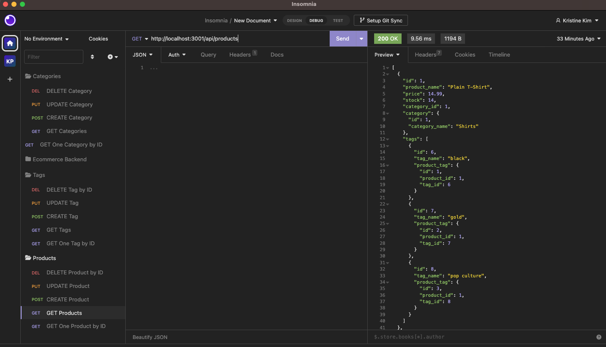

# E-Commerce Back End
> Back end for an e-commerce site with a configured working Express.js API to use Sequelize to interact with a MySQL database.
> Walkthrough Video [_here_](https://www.example.com). <!-- If you have the project hosted somewhere, include the link here. -->

## Table of Contents
* [General Info](#general-information)
* [Technologies Used](#technologies-used)
* [Features](#features)
* [Screenshots](#screenshots)
* [Setup](#setup)
* [Usage](#usage)
* [Project Status](#project-status)
* [Acknowledgements](#acknowledgements)
* [Contact](#contact)
<!-- * [License](#license) -->

## General Information
Given a functional Express.js API, the user is able to connect to a database using Sequelize once the database name, MySQL usernames, and MySQL password are added to an environment file.  When schema and seed commands are entered, a development database is created and is seeded with test data.  When the user enters the command to invoke the application in the terminal, the server is started and the Sequelize models are synced to the MySQL database.  The API GET routes for categories, products, or tags can all be opened in Insomnia which also the data for each of these routes is displayed in a formatted JSON.  The API POST, PUT, and DELETE routes can be tested in Insomnia and data can be successfully created, updated, and deleted in the database.
<!-- You don't have to answer all the questions - just the ones relevant to your project. -->

## Technologies Used
- Express.js
- Sequelize
- MySQL
- dotenv
- Nodemon

## Features
- GET all or one product, tag, or category with all of its data.
- POST, PUT, and DELETE products, tags, or categories.
- Awesome feature 3

## Screenshots

<!-- If you have screenshots you'd like to share, include them here. -->

## Setup
In order to get started with the project, the user must add the database name and MySQL username and password in the .env file.  In the terminal, use the commands to invoke MySQL, seed the database with test data, and run the application.

## Usage

`npm i`
`mysql -u root -p`
`SOURCE db/schema.sql;`
`npm run seed`
`npm run start` or `npm run watch` to use Nodemon

## Project Status
Project is: _in progress_ .

## Acknowledgements
- Many thanks to my instructor, Michael Pacheco, the TAs, Nirav and Julius, tutor Dane Shrewsbury, and all the AskBCS learning assistants.

## Contact
Created by Kristine Kim.  Feel free to contact me at kristinehkim@gmail.com!

<!-- Optional -->
<!-- ## License -->
<!-- This project is open source and available under the [... License](). -->

<!-- You don't have to include all sections - just the one's relevant to your project -->